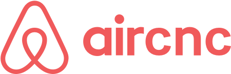

    

  

<h1>Sobre o Projeto</h1>

  <h3>O projeto AirCnC é uma paródia ao AirBnB e seu propósito é possibilitar que programadores possam visitar um espaço nas empressas que utilizam as mesmas tecnologias que as suas. Ajudando a compartilhar conhecimento, apoximando as empresas dos desenvolvedores e possibilitando que eles vivenciem um pouquinho da cultura do local. Facilitando uma possivel contratação.</h3>

  

<h1>Como Rodar</h1>

* É necessário rodar o comando ``npm install`` ou ``yarn install`` em todas as pastas (Frontend, Backend e Mobile) para instalar as dependências.

* Para rodar o Mobile é necessário installar o React-Native Expo, rode o comando ``npm install -g expo-cli`` para instalar.

* Para salvar os dados da aplicação é necessário um cluster MongoDB, assim como conectá-lo na aplicação, pelo arquivo Server.js (Backend).

* Para funcionar corretamento o envio e apresentação das imagens do spot, é necessário configurar corretamente o IP em api.js (Mobile/service).

  

<h1>Cadastro de Spot (Web)</h1>

  

  

<h1>Busca de Spots (Mobile)</h1>

  

  

<h1>TODO</h1>

* Implementar solicitação em tempo real via WebSockets

  

<h1>Sobre mim</h1>

> Linkedin - [Henrique Schmeller](https://www.linkedin.com/in/henriqueschmeller)  
> E-mail - [henrique_schmeller@hotmail.com](henrique_schmeller@hotmail.com)  

  

<h3 style="text-align: justify" > 
Agradecimentos especiais a todo o time da <a style="color: #7159c1" href='http://rocketseat.com.br' >Rocketseat</a>
💜.
</h3>